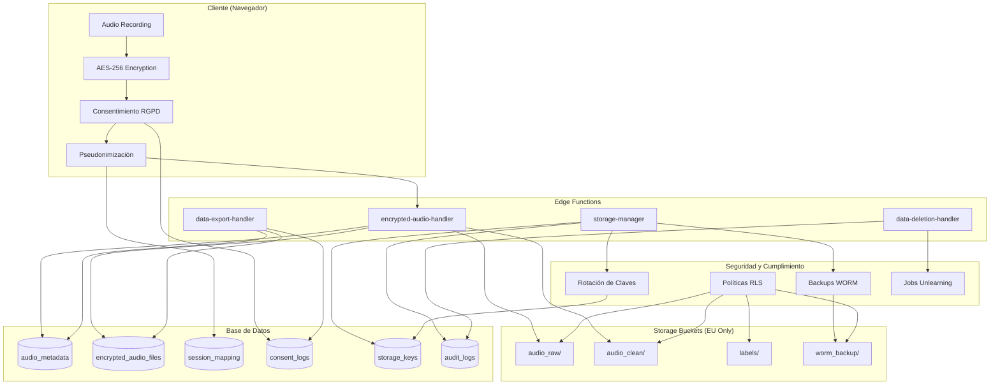

# Adagio - Sistema de Reconocimiento de Voz

Facilitando la comunicación para personas con habla atípica mediante tecnología de IA y cumplimiento RGPD.

## Arquitectura del Sistema

### Diagrama de Flujo de Datos y Storage



## Configuración de Storage

### Buckets y Políticas

#### 🔴 `audio_raw/` - Datos Originales (Máxima Seguridad)
- **Propósito**: Grabaciones originales sin procesar
- **Límite**: 10MB por archivo
- **Formatos**: WAV, MP3, OGG, WebM
- **Acceso**: Solo con consentimiento explícito de almacenamiento
- **Eliminación**: Prohibida (requiere proceso RGPD)
- **Localización**: Solo UE

```sql
-- Política: Solo usuarios con consentimiento pueden subir
CREATE POLICY "Restrict audio_raw uploads to consented sessions only"
ON storage.objects FOR INSERT 
WITH CHECK (
  bucket_id = 'audio_raw' AND
  (storage.foldername(name))[1] IN (
    SELECT session_pseudonym 
    FROM public.session_mapping 
    WHERE created_at > now() - INTERVAL '24 hours'
  )
);
```

#### 🟡 `audio_clean/` - Datos Procesados (Entrenamiento)
- **Propósito**: Grabaciones procesadas para entrenamiento de IA
- **Límite**: 10MB por archivo
- **Formatos**: WAV, MP3, OGG
- **Acceso**: Solo con consentimiento de entrenamiento
- **Actualizaciones**: Permitidas para procesamiento
- **Localización**: UE + procesamiento

```sql
-- Política: Acceso para entrenamiento con consentimiento
CREATE POLICY "Allow audio_clean access for training"
ON storage.objects FOR SELECT
USING (
  bucket_id = 'audio_clean' AND
  EXISTS (
    SELECT 1 FROM public.audio_metadata 
    WHERE session_pseudonym = (storage.foldername(name))[1]
    AND consent_train = true
  )
);
```

#### 🟢 `labels/` - Metadatos y Etiquetas
- **Propósito**: Metadatos, transcripciones y etiquetas de entrenamiento
- **Límite**: 1MB por archivo
- **Formatos**: JSON, TXT, CSV
- **Acceso**: Lectura amplia, escritura restringida
- **Actualizaciones**: Permitidas

#### 🔵 `worm_backup/` - Backups Inmutables (WORM)
- **Propósito**: Backups de cumplimiento a largo plazo
- **Límite**: 50MB por archivo
- **Formatos**: ZIP, GZIP, TAR
- **Acceso**: Write Once, Read Many
- **Actualizaciones**: **PROHIBIDAS** ❌
- **Eliminación**: **PROHIBIDA** ❌
- **Retención**: 7 años por defecto

```sql
-- Política WORM: Solo escritura única
CREATE POLICY "WORM backup write once policy"
ON storage.objects FOR INSERT 
WITH CHECK (
  bucket_id = 'worm_backup' AND
  name NOT IN (
    SELECT o.name FROM storage.objects o
    WHERE o.bucket_id = 'worm_backup'
  )
);
```

### Sistema de Rotación de Claves

#### Configuración Automática
- **Frecuencia**: Cada 30 días
- **Algoritmo**: AES-256-GCM
- **Versioning**: Incremental por bucket
- **Auditoría**: Completa en `audit_logs`

#### Rotación Manual
```typescript
// Ejemplo de uso
const { data } = await supabase.functions.invoke('storage-manager/manage', {
  body: {
    action: 'rotate-keys',
    bucketId: 'audio_raw'
  }
});
```

#### Tabla de Claves
```sql
CREATE TABLE public.storage_keys (
  id UUID PRIMARY KEY DEFAULT gen_random_uuid(),
  bucket_id TEXT NOT NULL,
  key_version INTEGER NOT NULL,
  key_hash BYTEA NOT NULL,
  encryption_algorithm TEXT DEFAULT 'AES-256-GCM',
  created_at TIMESTAMPTZ DEFAULT now(),
  expires_at TIMESTAMPTZ DEFAULT now() + INTERVAL '30 days',
  is_active BOOLEAN DEFAULT true,
  rotation_reason TEXT
);
```

### Backups WORM (Write Once Read Many)

#### Características
- **Inmutabilidad**: Una vez escritos, no se pueden modificar
- **Retención**: 7 años (configurable)
- **Compresión**: ZIP/GZIP automática 
- **Verificación**: Checksums SHA-256
- **Auditoría**: Registro completo de creación

#### Creación Automática
```typescript
// Crear backup WORM
const { data } = await supabase.functions.invoke('storage-manager/manage', {
  body: {
    action: 'create-backup',
    bucketId: 'audio_raw',
    backupName: 'monthly_backup_2024_01',
    retentionYears: 7
  }
});
```

#### Proceso de Backup
1. **Recopilación**: Todos los archivos del bucket origen
2. **Compresión**: ZIP con metadatos incluidos
3. **Cifrado**: AES-256 adicional para backups
4. **Verificación**: Checksums de integridad
5. **Almacenamiento**: Upload al bucket `worm_backup/`
6. **Auditoría**: Registro en `audit_logs`

## Cifrado y Seguridad

### Cifrado Cliente-Servidor

#### En el Cliente (Navegador)
```typescript
import { AudioEncryption } from '@/lib/encryption';

// Cifrar audio antes del envío
const encryptionResult = await AudioEncryption.encryptAudio(
  audioBlob, 
  masterKey, 
  keyVersion
);

// Resultado incluye:
// - encryptedData: ArrayBuffer cifrado
// - iv: Vector de inicialización único
// - salt: Salt para derivación de clave
// - keyVersion: Versión de clave usada
```

#### En el Servidor (Edge Functions)
```typescript
// Los datos llegan ya cifrados
const encryptedAudioData = {
  sessionId: session.sessionId,
  encryptedBlob: base64EncodedData,
  iv: base64EncodedIV,
  salt: base64EncodedSalt,
  // ... otros metadatos
};
```

### Pseudonimización

#### Generación de Pseudónimos
```sql
CREATE FUNCTION public.generate_pseudonym(original_session_id TEXT)
RETURNS TEXT AS $$
BEGIN
  RETURN 'ps_' || encode(
    digest(original_session_id || extract(epoch from now())::text, 'sha256'), 
    'hex'
  );
END;
$$ LANGUAGE plpgsql;
```

#### Separación de Datos
- **Tabla `session_mapping`**: Relación pseudónimo ↔ session_id real (cifrada)
- **Tabla `audio_metadata`**: Solo pseudónimos, nunca datos reales
- **Storage buckets**: Organizados por pseudónimos

## Cumplimiento RGPD

### Derechos del Usuario

#### 📥 Derecho de Portabilidad (Art. 20)
- **Endpoint**: `/my-data` → `data-export-handler`
- **Formato**: JSON + ZIP con audios cifrados
- **Contenido**: Metadatos, grabaciones, consentimientos, claves
- **Tiempo**: Inmediato

#### 🗑️ Derecho al Olvido (Art. 17)
- **Endpoint**: `/my-data` → `data-deletion-handler`
- **Proceso**: Eliminación completa + jobs de unlearning
- **Confirmación**: Email con hash de evidencia
- **Tiempo**: Máximo 30 días

#### 🔐 Derecho de Acceso (Art. 15)
- **Endpoint**: `/privacy-center`
- **Visualización**: Historial completo de consentimientos
- **Descarga**: Registros individuales
- **Tiempo**: Inmediato

### Consentimiento Granular

#### Tipos de Consentimiento
1. **`consent_train`**: Usar audio para entrenar el modelo de IA
2. **`consent_store`**: Guardar audio en la cuenta del usuario
3. **`consent_analytics`**: Compartir estadísticas anónimas

#### Registro de Consentimiento
```sql
CREATE TABLE public.consent_logs (
  id UUID PRIMARY KEY DEFAULT gen_random_uuid(),
  session_id TEXT NOT NULL,
  consent_train BOOLEAN DEFAULT false,
  consent_store BOOLEAN DEFAULT false,
  consent_timestamp TIMESTAMPTZ DEFAULT now(),
  withdrawn_at TIMESTAMPTZ NULL,
  ip_address INET,
  user_agent TEXT
);
```

#### Retirada de Consentimiento
- **Borrado lógico**: Campo `withdrawn_at`
- **Jobs de unlearning**: Tabla `unlearning_jobs`
- **Eliminación física**: Programada según políticas

### Auditoría y Compliance

#### Logs de Auditoría
```sql
CREATE TABLE public.audit_logs (
  id UUID PRIMARY KEY DEFAULT gen_random_uuid(),
  event_type TEXT NOT NULL,
  details JSONB NOT NULL,
  created_at TIMESTAMPTZ DEFAULT now(),
  retention_until TIMESTAMPTZ DEFAULT now() + INTERVAL '7 years'
);
```

#### Eventos Auditados
- `encrypted_file_uploaded`: Subida de archivo cifrado
- `worm_backup_created`: Creación de backup inmutable
- `storage_key_rotated`: Rotación de claves de cifrado
- `consent_withdrawn`: Retirada de consentimiento
- `data_deleted`: Eliminación de datos de usuario
- `unlearning_job_created`: Inicio de proceso de unlearning

## API Reference

### Edge Functions

#### `encrypted-audio-handler`
```typescript
// Almacenar audio cifrado
POST /store-audio
{
  sessionId: string,
  phraseText: string,
  encryptedBlob: string, // Base64
  iv: string,           // Base64
  salt: string,         // Base64
  consentTrain: boolean,
  consentStore: boolean
}
```

#### `storage-manager`
```typescript
// Rotar claves de cifrado
POST /manage
{
  action: 'rotate-keys',
  bucketId: 'audio_raw' | 'audio_clean' | 'labels' | 'worm_backup'
}

// Crear backup WORM
POST /manage
{
  action: 'create-backup',
  bucketId: string,
  backupName: string,
  retentionYears?: number
}

// Estadísticas de storage
GET /stats
```

#### `data-export-handler`
```typescript
// Exportar todos los datos del usuario
POST /export
{
  sessionId: string
}
```

#### `data-deletion-handler`
```typescript
// Eliminar todos los datos del usuario
POST /delete-all
{
  sessionId: string,
  confirmationEmail: 'eliminar@adagio.app',
  confirmationText: 'ELIMINAR TODOS MIS DATOS'
}
```

### Database Functions

#### Rotación de Claves
```sql
SELECT public.rotate_storage_key('audio_raw');
-- Devuelve: nueva versión de clave
```

#### Creación de Backups
```sql
SELECT public.create_worm_backup('audio_raw', 'backup_name', 7);
-- Devuelve: ID del backup creado
```

#### Generación de Pseudónimos
```sql
SELECT public.generate_pseudonym('session-id-real');
-- Devuelve: 'ps_a1b2c3d4...'
```

## Desarrollo

### Configuración Local
```bash
# Instalar dependencias
npm install

# Iniciar desarrollo
npm run dev

# Aplicar migraciones
npx supabase db push
```

### Variables de Entorno
```bash
VITE_SUPABASE_URL=https://proyecto.supabase.co
VITE_SUPABASE_ANON_KEY=clave_publica
```

### Testing
```bash
# Tests unitarios
npm run test

# Tests de integración
npm run test:integration

# Tests de seguridad
npm run test:security
```

## Monitoreo y Operaciones

### Métricas Clave
- **Tasa de cifrado exitoso**: >99.9%
- **Tiempo de rotación de claves**: <5 minutos
- **Tiempo de backup WORM**: <30 minutos
- **Cumplimiento RGPD**: <24h para exportación, <30d para eliminación

### Alertas
- Fallos en rotación de claves
- Errores en backups WORM
- Violaciones de políticas RLS
- Solicitudes de eliminación RGPD

### Dashboard de Compliance
- Consentimientos activos vs retirados
- Auditoría de accesos a datos
- Estado de jobs de unlearning
- Métricas de retención de datos

## Seguridad

### Threat Model
1. **Datos en tránsito**: TLS 1.3 obligatorio
2. **Datos en reposo**: AES-256-GCM
3. **Acceso no autorizado**: RLS + pseudonimización
4. **Cumplimiento**: Auditoría completa + WORM backups

### Incident Response
1. **Detección**: Logs automáticos + alertas
2. **Contención**: Desactivación automática de claves
3. **Investigación**: Análisis de audit_logs
4. **Recuperación**: Restore desde backups WORM
5. **Lessons Learned**: Actualización de políticas

---

## Licencia

MIT License - Ver [LICENSE](LICENSE) para detalles.

## Contacto

- **Privacidad**: privacy@adagio.app
- **DPO**: dpo@adagio.app
- **Soporte**: support@adagio.app