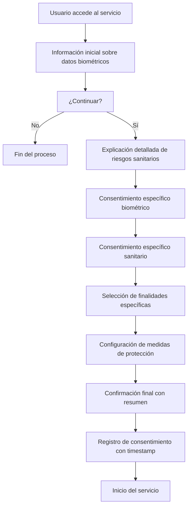

# Datos Biométricos de Voz y Información Sanitaria Implícita

## Resumen Ejecutivo

La voz humana constituye un **dato biométrico único** bajo el Reglamento General de Protección de Datos (RGPD) y puede contener **información sanitaria implícita**. Este documento establece el marco legal, técnico y ético para el tratamiento de grabaciones de voz en el sistema Adagio, incluyendo la justificación para la Evaluación de Impacto en la Protección de Datos (EIPD).

## 1. Naturaleza Biométrica de la Voz

### 1.1 Características Identificatorias Únicas

La voz humana contiene múltiples elementos biométricos que permiten la identificación individual:

```
Parámetros Biométricos de la Voz:
├── Fundamentales
│   ├── Frecuencia fundamental (F0)
│   ├── Formantes (F1, F2, F3, F4+)
│   └── Espectro de frecuencias único
├── Temporales
│   ├── Ritmo del habla
│   ├── Pausas características
│   └── Patrones prosódicos
├── Articulatorios
│   ├── Resonancia vocal
│   ├── Coarticulación
│   └── Patrones fonéticos individuales
└── Acústicos
    ├── Timbre vocal
    ├── Intensidad característica
    └── Ruido glotal específico
```

### 1.2 Base Legal RGPD

**Artículo 4(14) RGPD**: Define datos biométricos como datos personales obtenidos a partir de un tratamiento técnico específico, relativos a las características físicas, fisiológicas o conductuales de una persona física que permitan o confirmen la identificación única de dicha persona.

**Artículo 9(1) RGPD**: Clasifica los datos biométricos como **categoría especial de datos personales**, prohibiendo su tratamiento salvo excepciones específicas.

## 2. Información Sanitaria Implícita en la Voz

### 2.1 Indicadores de Salud Detectables

Las grabaciones de voz pueden revelar información sobre el estado de salud del hablante:

#### Trastornos Neurológicos
- **Parkinson**: Monotonía, reducción de intensidad, temblor vocal
- **Esclerosis Múltiple**: Disartria, fatiga vocal progresiva
- **Alzheimer**: Deterioro semántico, pausas anómalas, pérdida de fluidez
- **ALS**: Debilidad bulbar, cambios articulatorios progresivos

#### Condiciones Respiratorias
- **Asma**: Patrón respiratorio alterado, sibilancias sutiles
- **EPOC**: Reducción de capacidad pulmonar, frases entrecortadas
- **Apnea del Sueño**: Ronquidos, interrupciones respiratorias

#### Trastornos Psiquiátricos
- **Depresión**: Monotonía emocional, lentitud del habla
- **Ansiedad**: Tensión vocal, ritmo acelerado, temblor
- **Trastorno Bipolar**: Fluctuaciones en velocidad y tono

#### Condiciones Físicas
- **Laringitis**: Ronquera, pérdida de armónicos agudos
- **Pólipos vocales**: Rugosidad vocal, cambios de timbre
- **Fatiga general**: Reducción de energía vocal

### 2.2 Clasificación Legal

Bajo el **Artículo 4(15) RGPD**, esta información constituye **datos relativos a la salud**: datos personales relativos a la salud física o mental de una persona física, incluida la prestación de servicios de atención sanitaria, que revelen información sobre su estado de salud.

## 3. Marco de Consentimiento Requerido

### 3.1 Doble Base Legal

El tratamiento de grabaciones de voz requiere **doble consentimiento explícito**:

#### Consentimiento Biométrico (Art. 9.2.a RGPD)
```
Formulación requerida:
"Consiento expresamente el tratamiento de mis datos biométricos 
de voz, incluyendo características físicas y fisiológicas únicas 
contenidas en mi patrón vocal, para los fines específicos de 
transcripción automática y entrenamiento de modelos de IA."
```

#### Consentimiento Sanitario (Art. 9.2.a RGPD)
```
Formulación requerida:
"Comprendo y consiento que mi grabación de voz puede contener 
información implícita sobre mi estado de salud. Autorizo el 
tratamiento de esta información potencial exclusivamente para 
los fines declarados del servicio de transcripción."
```

### 3.2 Requisitos de Validez del Consentimiento

Según el **Artículo 7 RGPD**, el consentimiento debe ser:

1. **Libre**: Sin coacción, con alternativas reales
2. **Específico**: Para fines claramente definidos
3. **Informado**: Con comprensión completa de las implicaciones
4. **Inequívoco**: Mediante declaración clara o acto afirmativo claro

### 3.3 Información Previa Obligatoria (Art. 13 RGPD)

```yaml
Información_Previa_Requerida:
  Responsable: "Adagio - Servicio de Transcripción"
  Finalidades:
    - "Transcripción de audio a texto"
    - "Entrenamiento de modelos de IA (opcional)"
    - "Almacenamiento personal (opcional)"
  Base_Legal: "Consentimiento explícito (Art. 6.1.a y 9.2.a RGPD)"
  Categorías_Datos:
    - "Datos biométricos de voz"
    - "Datos de salud implícitos potenciales"
  Conservación: "Hasta retirada del consentimiento"
  Derechos_Interesado:
    - "Acceso, rectificación, supresión"
    - "Portabilidad, limitación, oposición"
    - "Retirada del consentimiento"
  Transferencias: "No se realizan transferencias internacionales"
  Decisiones_Automatizadas: "Transcripción automática mediante IA"
```

## 4. Evaluación de Impacto en la Protección de Datos (EIPD)

### 4.1 Obligatoriedad Legal

**Artículo 35.1 RGPD** establece que la EIPD es obligatoria cuando el tratamiento "entrañe un alto riesgo para los derechos y libertades de las personas físicas".

**Artículo 35.3.b RGPD** especifica que se requiere EIPD para "el tratamiento a gran escala de las categorías especiales de datos personales".

### 4.2 Factores de Alto Riesgo Identificados

#### Riesgo Biométrico
- **Identificación Permanente**: Los datos biométricos no pueden modificarse
- **Vulnerabilidad**: Compromiso permanente si hay brecha de seguridad
- **Discriminación**: Posible uso indebido para perfilado no autorizado

#### Riesgo Sanitario
- **Información Sensible**: Revelación inadvertida de condiciones médicas
- **Estigmatización**: Discriminación basada en inferencias de salud
- **Privacidad Médica**: Violación del secreto de la información sanitaria

#### Riesgo Tecnológico
- **Inferencia Automática**: Capacidad de IA para extraer información no evidente
- **Perfilado Avanzado**: Construcción de perfiles detallados sin conocimiento del usuario
- **Escalabilidad**: Procesamiento masivo amplifica los riesgos individuales

### 4.3 Metodología de Evaluación

```
EIPD_Framework:
├── Evaluación_Necesidad
│   ├── Identificación de riesgos específicos
│   ├── Análisis de proporcionalidad
│   └── Justificación de legitimidad
├── Descripción_Tratamiento
│   ├── Naturaleza y alcance
│   ├── Finalidades específicas
│   └── Intereses legítimos
├── Evaluación_Riesgos
│   ├── Identificación de amenazas
│   ├── Análisis de vulnerabilidades
│   ├── Evaluación de impacto
│   └── Cálculo de riesgo residual
├── Medidas_Mitigación
│   ├── Salvaguardias técnicas
│   ├── Medidas organizativas
│   └── Controles de acceso
└── Consulta_DPD
    ├── Revisión independiente
    ├── Recomendaciones específicas
    └── Aprobación formal
```

## 5. Medidas de Protección Implementadas

### 5.1 Salvaguardias Técnicas

#### Cifrado de Extremo a Extremo
```typescript
// Implementación de cifrado AES-256-GCM
const encryptVoiceData = async (audioBlob: Blob, sessionKey: CryptoKey) => {
  const iv = crypto.getRandomValues(new Uint8Array(12));
  const audioBuffer = await audioBlob.arrayBuffer();
  
  const encrypted = await crypto.subtle.encrypt(
    { name: 'AES-GCM', iv },
    sessionKey,
    audioBuffer
  );
  
  return { encrypted, iv };
};
```

#### Minimización de Datos
- Procesamiento local cuando es posible
- Eliminación automática de metadatos no esenciales
- Compresión con pérdida controlada para reducir información biométrica

#### Anonimización Progresiva
```python
# Técnicas de desidentificación vocal
def anonymize_voice_features(audio_features):
    # Perturbación de F0 dentro de rangos seguros
    f0_perturbation = np.random.normal(0, 2, len(audio_features.f0))
    audio_features.f0 += f0_perturbation
    
    # Normalización de intensidad
    audio_features.intensity = normalize_intensity(audio_features.intensity)
    
    # Filtrado de características identificatorias
    return filter_identifying_features(audio_features)
```

### 5.2 Salvaguardias Organizativas

#### Control de Acceso Estricto
- Autenticación multifactor para personal autorizado
- Principio de menor privilegio
- Auditoría completa de accesos

#### Formación Especializada
- Concienciación sobre datos biométricos
- Protocolos de manejo de información sanitaria
- Procedimientos de respuesta a incidentes

#### Supervisión Continua
- Monitorización de anomalías en el procesamiento
- Revisiones periódicas de consentimientos
- Auditorías de cumplimiento trimestrales

## 6. Derechos Específicos del Interesado

### 6.1 Derechos Reforzados para Datos Biométricos

#### Derecho de Información Detallada
- Explicación clara sobre qué información biométrica se extrae
- Descripción de posibles inferencias de salud
- Detalle de medidas de protección específicas

#### Derecho de Acceso Mejorado
```json
{
  "voice_biometric_data": {
    "fundamental_frequency_range": "80-180 Hz",
    "formant_characteristics": "F1: 700Hz, F2: 1220Hz, F3: 2600Hz",
    "speech_rate": "4.2 syllables/second",
    "potential_health_indicators": "none_detected",
    "anonymization_level": "medium"
  },
  "processing_history": [
    {
      "timestamp": "2024-01-15T10:30:00Z",
      "operation": "transcription",
      "consent_basis": "explicit_biometric_consent"
    }
  ]
}
```

#### Derecho de Rectificación Especializado
- Corrección de inferencias incorrectas sobre salud
- Actualización de categorías biométricas
- Modificación de niveles de anonimización

### 6.2 Derecho de Supresión Inmediata

Para datos biométricos, el derecho de supresión tiene **carácter prioritario**:

```typescript
const executeImmediateDeletion = async (userId: string) => {
  // 1. Eliminación de datos primarios
  await deleteVoiceRecordings(userId);
  
  // 2. Eliminación de características extraídas
  await deleteBiometricFeatures(userId);
  
  // 3. Eliminación de modelos personalizados
  await deletePersonalizedModels(userId);
  
  // 4. Purga de copias de seguridad
  await purgeBackupCopies(userId);
  
  // 5. Verificación de eliminación completa
  return await verifyCompleteDeletion(userId);
};
```

## 7. Procedimiento de Consentimiento Implementado

### 7.1 Flujo de Consentimiento Graduado



### 7.2 Interfaz de Consentimiento

La interfaz debe incluir:

1. **Explicación Visual** de qué información biométrica se captura
2. **Ejemplos Específicos** de posibles inferencias de salud
3. **Controles Granulares** para cada tipo de procesamiento
4. **Información de Contacto** del Delegado de Protección de Datos
5. **Enlaces Directos** a herramientas de ejercicio de derechos

## 8. Revisión y Actualización

### 8.1 Cronograma de Revisión

- **Mensual**: Revisión de consentimientos activos
- **Trimestral**: Actualización de evaluaciones de riesgo
- **Semestral**: Auditoria completa de EIPD
- **Anual**: Revisión integral del marco legal

### 8.2 Triggers de Actualización

- Cambios en la tecnología de procesamiento de voz
- Nuevas capacidades de inferencia de IA
- Modificaciones en el marco regulatorio
- Incidentes de seguridad o privacidad
- Solicitudes de las autoridades de control

## 9. Contacto y Recursos

**Delegado de Protección de Datos**
- Email: dpo@adagio.es
- Teléfono: +34 XXX XXX XXX

**Autoridad de Control Competente**
- Agencia Española de Protección de Datos (AEPD)
- www.aepd.es

**Documentación Adicional**
- Política de Privacidad Completa: `/privacy-policy`
- Centro de Privacidad: `/privacy-center`
- Gestión de Datos Personales: `/my-data`

---

*Este documento se actualiza regularmente para reflejar los últimos desarrollos legales y tecnológicos. Última actualización: 27 de agosto de 2024.*